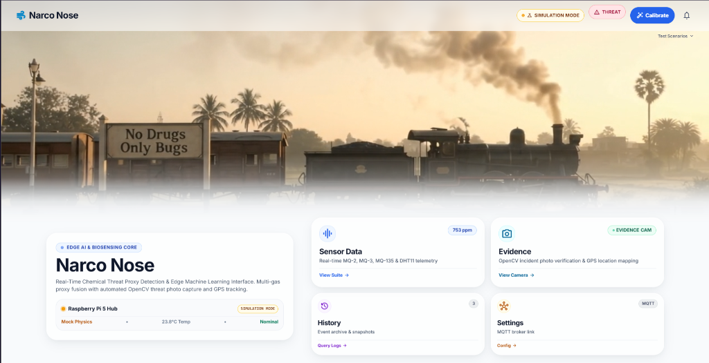
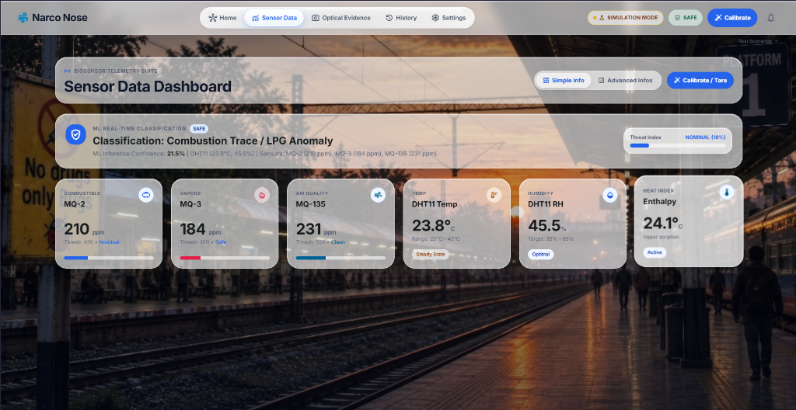
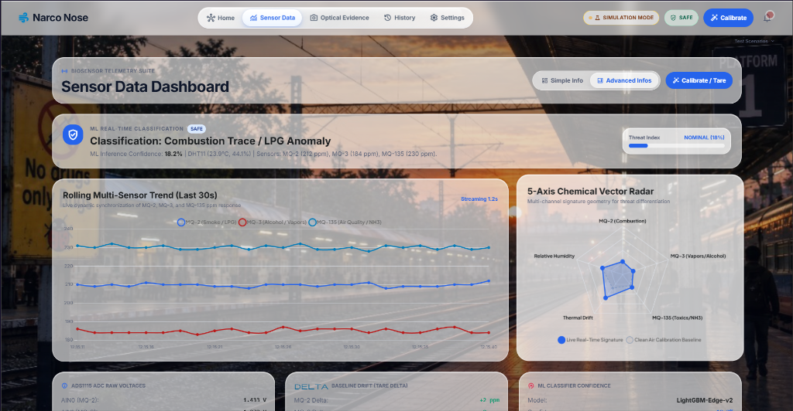
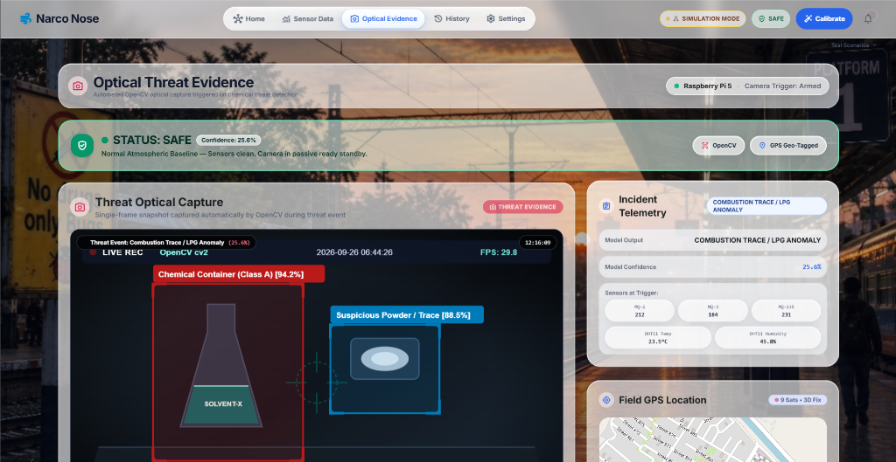
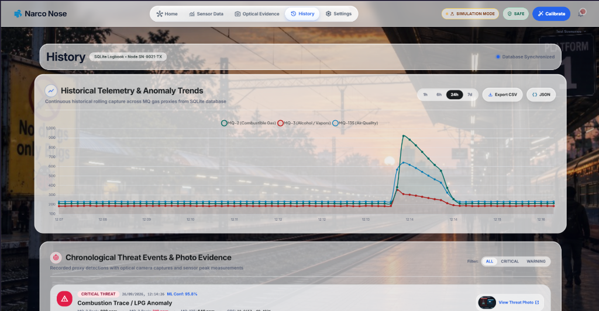
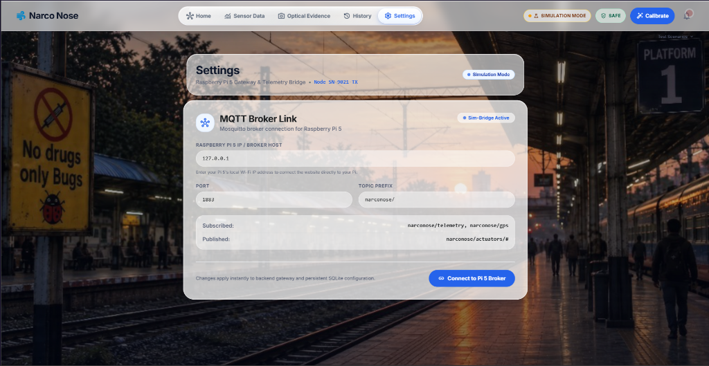

# Narco Nose

An edge-computed electronic nose and optical surveillance telemetry system that detects, classifies, and maps chemical and narcotic proxy vapors in real time.

## The Problem & The Solution

Security checkpoints, railway coaches, baggage corridors, and enclosed transit infrastructure face persistent challenges in detecting concealed narcotics, illicit volatile solvents, and hazardous chemical contraband. Traditional screening methods depend heavily on canine units that experience olfactory fatigue within thirty to forty minutes, or manual swab and ion mobility spectrometers that require direct physical contact and cannot provide continuous, automated perimeter coverage. These operational constraints create surveillance blind spots across high-throughput transport hubs.

Narco Nose addresses this limitation by deploying an autonomous edge-sensing node built on a Raspberry Pi 5 platform paired with a multi-channel metal oxide semiconductor gas sensor array (MQ-2, MQ-3, MQ-135) and environmental transducers (DHT11). The system runs local baseline-compensated gas signature classification alongside camera-based optical object detection. Real-time telemetry, spatial GPS coordinates, and threat captures are published over an embedded MQTT broker and bidirectional WebSockets into a centralized browser dashboard, providing security operators with immediate threat alerts, physical actuator countermeasures, and forensic audit logs.

## Tech Stack

*   **Frontend**: React 19, Vite 8, Tailwind CSS, Chart.js (`react-chartjs-2`), Leaflet (`react-leaflet`), Framer Motion, Lucide React
*   **Backend**: Node.js (v20+), Express 5, Socket.io, Aedes (embedded MQTT broker), SQLite3
*   **Hardware Architecture**: Raspberry Pi 5, MQ-2 (Combustible Gas/Smoke), MQ-3 (Solvent/Alcohol Vapor), MQ-135 (Air Quality/Ammonia/Benzene), DHT11 (Temperature & Relative Humidity), ADS1115 16-bit ADC, NEO-6M GPS Module, USB/CSI Optical Camera
*   **Protocols & Transport**: MQTT (port 1883), WebSocket duplex telemetry (`socket.io`), HTTP REST APIs
*   **Data Persistence**: SQLite database (`server/narco_nose.db`) with disk-backed optical threat snapshot storage

## Page-by-Page Feature Walkthrough & Automated Screenshots

### Home Hub



*   **System Status Overview**: Provides real-time hardware status, active sensor counts, edge temperature readings, and operational state for Raspberry Pi 5 Node SN-9021-TX.
*   **Dynamic Threat Evaluation**: Computes and displays system-wide composite risk state (Safe, Warning, Critical Threat) synthesized from live multi-gas analytics.
*   **Bento Routing Grid**: Houses quick-navigation panels for Sensor Data, Evidence, History, and Settings with interactive perimeter edge-lighting.
*   **Quick Simulation Suite**: Includes embedded triggers to inject vapor spikes, LPG leak signatures, and chamber purge cycles for validation when running detached from physical hardware.
*   **Live Sensor Calibration**: Dedicated header controls to tare and recalibrate sensor baselines across active nodes.

### Sensor Data Dashboard





*   **Multi-Channel Gas Readouts**: Displays live numerical concentrations for MQ-2 (combustible gas), MQ-3 (alcohol/solvent vapor proxies), and MQ-135 (toxic gases/ammonia).
*   **Environmental Telemetry**: Tracks ambient temperature, relative humidity, and enthalpy index derived from DHT11 sensor readings to evaluate vapor dispersion conditions.
*   **Dual Inspection Modes**: Offers Simple Info mode for clear high-visibility field metrics and Advanced Infos mode for technical vector breakdown.
*   **Synchronized Time-Series Chart**: Renders a rolling 30-second multi-gas ppm trend chart powered by Chart.js for tracking plume rise and decay rates.
*   **Five-Axis Vector Radar**: Maps live gas ratios against baseline ambient signatures to assist in identifying specific chemical classifications.
*   **ADC Conversion Matrix**: Displays live 16-bit analog voltages and raw offsets from the ADS1115 analog-to-digital converter.
*   **Baseline Drift Tracking**: Real-time delta tracking comparing live signal resistance to clean-air calibration references.

### Optical Threat Evidence



*   **Optical Inspection Feed**: Displays real-time camera imagery coupled with target classification bounding boxes and model confidence scores for identified items such as Class A chemical containers and suspicious powders.
*   **Threat Telemetry Overlay**: Synchronizes captured optical frames with simultaneous sensor readings (gas ppm, temperature, timestamp) recorded at the exact moment of detection.
*   **Interactive GPS Tracker**: Renders live coordinate positioning via Leaflet, including latitude, longitude, altitude, ground speed, satellite fix quality (3D Fix), and breadcrumb route trails.
*   **Bounding Box HUD Toggle**: Allows security personnel to enable or disable classification labels and target highlight boxes on the fly.
*   **Evidentiary Capture**: Automatically logs threat events with visual snapshot verification and GPS geo-tagging.

### History and Event Logs



*   **Historical Telemetry Trends**: Visualizes continuous multi-gas historical graphs querying SQLite database records across 1h, 6h, 24h, and 7d horizons with anomaly spike detection.
*   **Chronological Incident Timeline**: Records all detected threat events with classified anomaly types, severity badges (Critical Threat, Warning), and occurrence timestamps.
*   **Snapshot Inspection Modal**: Enables operators to select any logged incident to inspect the stored optical frame and review associated gas readings.
*   **Data Export Pipeline**: Features dedicated endpoints to download complete incident logs in standardized CSV and JSON formats for external security audits.
*   **Severity Filtering**: Allows filtering incidents based on threat severity level and sensor threshold triggers.

### Device Settings & Gateway Configuration



*   **Gateway & Telemetry Bridge**: Centralized interface to manage hardware communication parameters between the dashboard and Raspberry Pi 5 Node SN-9021-TX.
*   **MQTT Broker Link**: Configuration panel for establishing connections to a local or remote Mosquitto MQTT broker.
*   **Host and Port Binding**: Configurable parameters for broker IP address (e.g., local Wi-Fi IP address or loopback `127.0.0.1`) and port number (`1883`).
*   **Topic Namespace Management**: Configurable prefix (`narconose/`) with explicit telemetry subscriptions (`narconose/telemetry`, `narconose/gps`) and command publications (`narconose/actuators/#`).
*   **Persistent Configuration**: Immediate local SQLite persistence ensuring broker reconnection across restarts and network interruptions.

## Local Setup & Installation

### Prerequisites

*   Node.js v20.0.0 or higher (compatible up to Node.js v22.x)
*   npm v9.0.0 or higher
*   Git command line tools

### Installation Steps

1. Clone the repository:

```bash
git clone https://github.com/ankursinGGha/narco_nose.git
cd narco_nose
```

2. Install dependencies:

```bash
npm install
```

3. Configure environment variables (optional):

The application functions out of the box using default settings. If custom network bindings or ports are required, create a `.env` file in the project root:

```bash
# Server configuration
PORT=5000

# MQTT broker settings
MQTT_PORT=1883
MQTT_HOST=127.0.0.1

# Node environment
NODE_ENV=development
```

4. Launch the application:

To run both the backend server and frontend development server concurrently with hot reload:

```bash
npm run dev
```

Alternatively, to compile the production bundle and launch the integrated full-stack server:

```bash
node start.js
```

5. Access the application:

Open a web browser and navigate to `http://localhost:5173` (Vite dev server) or `http://localhost:5000` (full-stack production server).

## Hackathon Track / Category

*   **Target Track**: [Insert Hackathon Track Name Here, e.g., Smart Cities / Public Safety / IoT & Edge Computing]
*   **Problem Statement**: [Insert Target Problem Statement or Challenge ID Here]
*   **Team Name**: [Insert Team Name Here]
